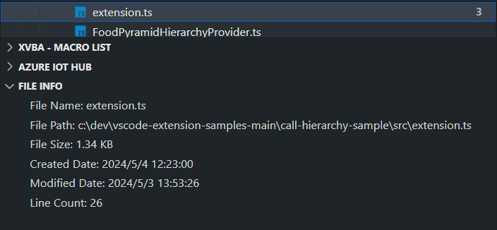

# File Property

Displays the properties of the selected file in a tree view.
  

## Features

- Displays properties of the selected file, such as file size and modified date.
- You can copy the displayed properties to the clipboard.

## Usage1

1. Select file.
2. The properties of the selected file are displayed in the tree view `FILE INFO`.
3. Click `Copy All Property` to copy the property to the clipboard.

## Requirements

- Visual Studio Code 1.38.0 or newer

## License

Licensed under MIT
